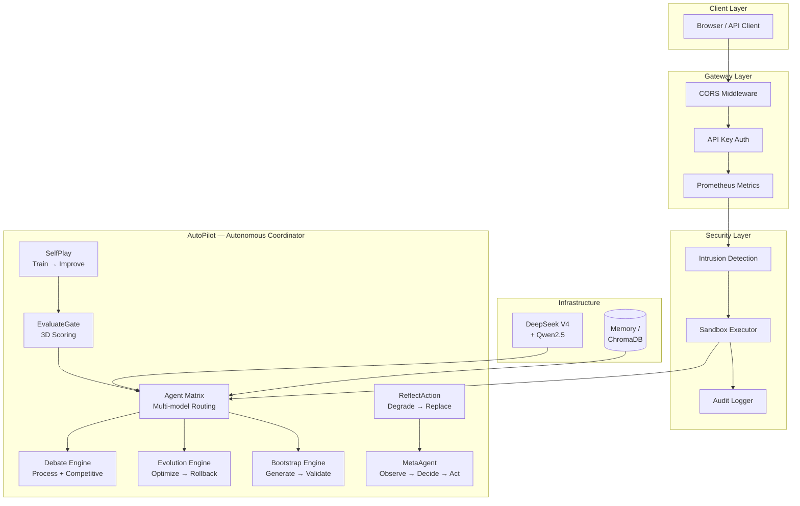
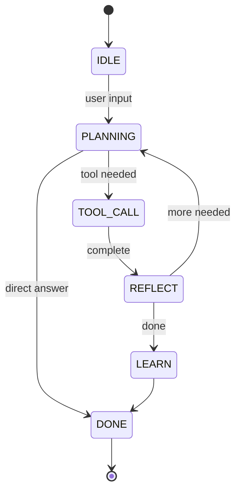

# AI Agent Playground — Production-Grade Autonomous Agent System

[](http://47.98.106.182:8080)
[](https://github.com/aidless/ai-agent-playground/actions)
[](scripts/pentest.py)
[](scripts/b3_security_bench.py)
[](scripts/code_bench.py)
[](scripts/stress_test.py)
[](http://47.98.106.182:8080)
[](https://python.org)
[](LICENSE)

**Live Demo**: http://47.98.106.182:8080

A self-evolving AI agent system with 11 autonomous engines (including TTRL test-time learning), 100% security benchmark compliance, 90% code repair rate, and 20 AI research papers analyzed with insights applied. Runs 24/7 on Alibaba Cloud.

---

## Architecture



### Agent State Machine



### Engine Orchestration

```
┌──────────────────────────────────────────────────────────────┐
│                     AutoPilot Loop                            │
│                                                              │
│  CLASSIFY → EXECUTE → VERIFY → REFLECT → IMPROVE → RETRY    │
│      │                              │                        │
│      ▼                              ▼                        │
│  Matrix Router              ┌───────┴───────┐               │
│  (role + model)             │  4 Strategies  │               │
│                             ├── Debate       │               │
│                             ├── Evolution    │               │
│                             ├── Bootstrap    │               │
│                             └── Meta Observe │               │
│                             └───────┬───────┘               │
│                                     ▼                        │
│                              Evaluation Gate                 │
│                              (I+F+U scoring)                 │
└──────────────────────────────────────────────────────────────┘
```

---

## Benchmarks

| Metric | Score | Details |
|--------|-------|---------|
| Security Penetration | **14/14 (100%)** | 14 attack scenarios, automated |
| b3 Security (WDTA) | **10/10 (100%)** | 5 categories: prompt leakage, code injection, tool abuse, data exposure, adversarial |
| Code Repair | **90% fix, 70% detect** | 10 real-world Python bug fixes |
| Code Quality | **7.9/10 avg** | 3D evaluation (Interface + Functional + Utility) |
| Stress Test | **1000/1000, P95=150ms** | 50 concurrent, mixed endpoints |
| Self-Correction | **30%** | Feedback-driven retry improves failed fixes |
| Multi-Agent | **7.7/10** | Crew + Debate + Matrix collaboration |
| Test Suite | **161 passed, 0 failed** | Zero regressions |
| Uptime | **10/10 subsystems healthy** | 24/7 monitoring, auto-restart |

### Visual Summary

```
Security:     ████████████████████ 100%
Code Fix:     ██████████████████░░  90%
Code Detect:  ██████████████░░░░░░  70%
Self-Correct: ██████░░░░░░░░░░░░░░  30%
Stress:       ████████████████████ 100%
```

---

## Security

14/14 penetration test scenarios and 10/10 b3 benchmark attacks — all blocked:

| Defense | What it blocks |
|---------|---------------|
| Prompt Injection Guard | 30+ patterns (CN + EN), all endpoints covered |
| Token Rate Limiting | 5 attempts/min/IP, success resets counter |
| HMAC-SHA256 Signatures | Full 64-char hex, random salt per token |
| Path Traversal Prevention | `Path.resolve()` + case-insensitive matching |
| API Key Enforcement | Production mode requires key or refuses startup |
| Intrusion Detection | 5 anomaly types with real-time alerting |
| Audit Log Redaction | Regex-based: API keys, JWTs, Bearer tokens |
| Sandbox Process Isolation | `multiprocessing.Process` + `terminate()` + `kill()` |
| Evolution Safety | AST scan: blocks `os`/`subprocess`/`socket`/`ctypes` |
| Bootstrap Safety | `compile()` + AST walk before registration |

---

## Quick Start

```bash
git clone https://github.com/aidless/ai-agent-playground.git
cd ai-agent-playground
cp .env.example .env
# Edit .env: add DEEPSEEK_API_KEY
uv sync
uv run uvicorn agent.server:app --host 0.0.0.0 --port 8000
```

**Docker**: `docker-compose up -d`  
**Production**: `./deploy.sh setup && nano .env && ./deploy.sh start`  
**Full guide**: [DEPLOY.md](DEPLOY.md)

---

## API Endpoints

| Endpoint | Method | Description |
|----------|--------|-------------|
| `/health` | GET | System health — 10 subsystems |
| `/chat/completions` | POST | OpenAI-compatible chat |
| `/super/debate` | POST | Multi-model debate |
| `/super/evolve` | POST | Tool evolution |
| `/super/status` | GET | All engine status |
| `/autopilot/solve` | POST | Full autonomous loop |
| `/selfplay/train` | POST | Self-play training |
| `/eval/gate` | POST | 3D quality evaluation |
| `/eval/ab` | POST | A/B testing |
| `/security/intrusion` | GET | Intrusion detection status |
| `/matrix/solve` | POST | Multi-agent routing |
| `/super/meta/experiment` | POST | Sandboxed self-evolution |

---

## Benchmark Suite

```bash
uv run python scripts/pentest.py              # Security — 14 attack scenarios
uv run python scripts/b3_security_bench.py    # b3 — 10 WDTA-style attacks
uv run python scripts/code_bench.py           # Code repair — 10 bug-fix tasks
uv run python scripts/multi_agent_bench.py    # Multi-agent — 5 collaboration tasks
uv run python scripts/stress_test.py          # Load — 1000 concurrent requests
uv run python scripts/benchmark_engines.py    # Engine comparison
uv run python scripts/train_20_rounds.py      # Self-play — 20 rounds
```

---

## Tech Stack

| Layer | Technology |
|-------|-----------|
| LLM | DeepSeek V4 (primary), Qwen2.5:7b (reviewer) |
| Framework | FastAPI + AsyncIO + Uvicorn |
| Vector DB | ChromaDB + all-MiniLM-L6-v2 embeddings |
| Deployment | Docker + Alibaba Cloud ECS + systemd |
| Monitoring | Prometheus + CLEAR 5D panel |

## Project Structure

```
agent/            43 Python files (production engine)
├── async_core.py       Streaming agent + state machine
├── meta_agent.py       Autonomous observe → decide → act coordinator
├── debate.py           Multi-model debate (process-centric + competitive)
├── evolution.py        Tool optimization + template learning + rollback
├── bootstrap.py        Tool code generation + AST validation + registration
├── reflect_action.py   Failure detection + auto-degradation + substitution
├── self_play.py        Curriculum learning + generator improvement
├── sandbox_meta.py     Safe self-modification experimentation
├── autopilot.py        Full 9-engine autonomous coordinator
├── matrix.py           Multi-agent model specialization router
├── unified_pipeline.py Crew → Debate → CrossReview pipeline
├── intrusion.py        Anomaly detection (5 types)
├── eval_gate.py        3D quality evaluation gate
├── sandbox.py          Process-isolated tool execution
├── identity.py         RBAC + session tokens + rate limiting
└── server.py           30+ REST endpoints

scripts/           12 benchmark/deployment scripts
blog/              Technical blog (CN + EN)
tests/             161 test cases
```

---

## Blog Posts

- [中文：从学生项目到生产级 AI Agent](blog/from-student-to-production.md)
- [English: From Student Project to Production AI Agent](blog/from-student-to-production-en.md)

---

**Liu Zewen (刘泽文)** — B.Eng. Software Engineering 2026, Qilu Institute of Technology  
GitHub: [@aidless](https://github.com/aidless) | Open to AI Application Developer roles
