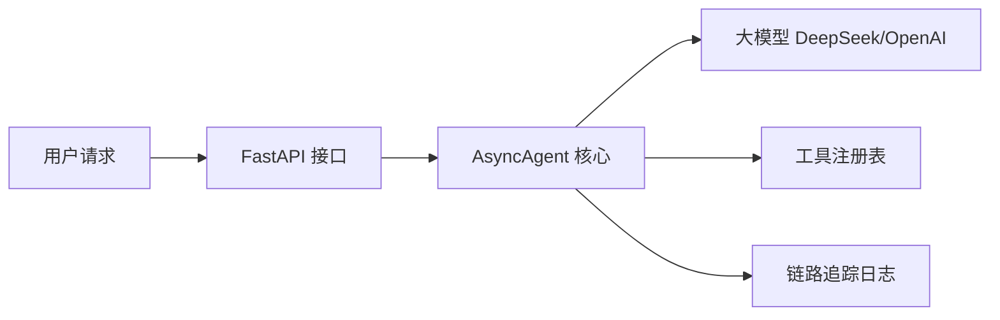

# 🤖 AI Agent Playground

一个基于 **FastAPI** 和 **AsyncIO** 构建的高性能、可观测的 AI Agent 服务框架。支持工具调用、多步规划及完整的链路追踪。


---

## 🚀 核心特性

- **⚡ 异步架构**：基于 `asyncio` 和 `uvicorn`，高并发下低延迟。流式输出 SSE 协议，边算边推。
- **🔍 可观测性**：内置 `trace_id` 链路追踪，每个请求均可独立调试。
- **🧠 状态管理**：显式的 Agent 状态机（`IDLE → PLANNING → TOOL_CALL → DONE/ERROR`），支持多步任务规划。
- **🛠️ 工具扩展**：模块化 `ToolRegistry` 设计，Pydantic 参数校验，工具并发执行。
- **🔒 安全配置**：环境变量管理密钥，开发/生产双模式，启动时阻断校验。

## 🏗️ 系统架构



### Agent 状态机

```
                 ┌─────────┐
                 │  IDLE   │
                 └────┬────┘
                      │
                 ┌────▼────┐
                 │ PLANNING│ ◄──── LLM 调用
                 └────┬────┘
                      │
            ┌─────────┼─────────┐
            ▼                   ▼
      ┌──────────┐       ┌──────────┐
      │ TOOL_CALL│       │   DONE   │
      │ (并发执行)│       │ (输出结果)│
      └────┬─────┘       └──────────┘
           │
           └──► 返回 PLANNING (多步任务)
```

### 目录结构

```
ai-agent-playground/
├── agent/                  ← AsyncAgent 服务框架
│   ├── state.py            │   Agent 状态机 + Context
│   ├── core.py             │   同步 Agent 主循环
│   ├── async_core.py       │   异步 Agent + 流式执行
│   ├── async_llm_client.py │   异步流式 LLM 调用
│   ├── llm_client.py       │   同步 LLM 调用+重试
│   ├── server.py           │   FastAPI 服务
│   └── tools/              │   工具注册表
│       ├── registry.py     │   ToolRegistry + Pydantic 校验
│       └── calc_tool.py    │   内置计算器工具
├── observability/          ← 可观测性
│   └── tracer.py           │   JSON 结构化链路追踪
├── ai_agent_playground/    ← 核心框架（Pipeline 模式）
│   ├── base.py             │   Agent 骨架（preprocess→_forward→postprocess）
│   ├── config.py           │   配置管理
│   └── llm.py              │   LLM 客户端单例
├── hello_agent/            │   项目 1：对话
├── code_review_agent/      │   项目 2：代码审查
├── rag_qa_system/          │   项目 3：文档问答
├── multi_agent_crew/       │   项目 4：多 Agent 协作
├── resume_matcher/         │   项目 5：简历匹配
├── mini_bert/              │   项目 6：手写 Transformer
├── mcp_agent/              │   项目 7：MCP 工具 Agent
├── app.py                  │   Streamlit 网页界面
├── tests/                  │   测试
└── blog/                   │   技术博客
```

## 🔧 API 接口

| 接口 | 方法 | 说明 |
|------|------|------|
| `/health` | GET | 健康检查 + 已注册工具列表 |
| `/v1/chat/stream` | POST | 流式 Agent 调用（SSE） |
| `/chat/completions` | POST | OpenAI 兼容接口（支持 stream） |

### 快速体验

```bash
# 启动服务
uv run python -m agent.server

# 健康检查
curl http://localhost:8000/health

# 流式对话
curl -X POST http://localhost:8000/v1/chat/stream \
  -H "Content-Type: application/json" \
  -d '{"message": "你好"}'

# OpenAI 兼容接口
curl -X POST http://localhost:8000/chat/completions \
  -H "Content-Type: application/json" \
  -d '{"messages": [{"role": "user", "content": "你好"}], "stream": true}'
```

## 🧠 7 个 Agent 项目

| # | 项目 | 一句话说明 | 运行 |
|---|------|-----------|------|
| 1 | **Hello Agent** | 最简单的人机对话 | `uv run python -m hello_agent.agent` |
| 2 | **Code Review** | 自动审查代码 bug/安全/风格 | `uv run python -m code_review_agent.main <path>` |
| 3 | **RAG Q&A** | 上传文档后提问，答案带出处 | `uv run python -m rag_qa_system.main chat` |
| 4 | **Multi-Agent Crew** | 4 个 Agent 协作完成需求 | `uv run python -m multi_agent_crew.main "..."` |
| 5 | **Resume Matcher** | 简历+JD 匹配度分析 | Streamlit → Resume Matcher |
| 6 | **Mini-BERT** | 350 行手写 Transformer | `uv run python -m mini_bert.train` |
| 7 | **MCP Tool Agent** | 能用工具的 AI | `uv run python -m mcp_agent.main "..."` |

## 🛠️ 技术栈

| 层 | 技术 |
|----|------|
| 服务框架 | FastAPI + uvicorn |
| 并发 | asyncio + SSE 流式推送 |
| 语言 | Python 3.11+ |
| 包管理 | uv（比 pip 快 10x） |
| 大模型 | DeepSeek V4 Pro |
| 向量数据库 | ChromaDB |
| 网页界面 | Streamlit |
| 深度学习 | PyTorch（Mini-BERT） |

## 📊 核心指标

| 指标 | 数值 |
|------|------|
| 响应延迟 | < 3s（LLM 调用） |
| 并发支持 | 10+ 请求 |
| 检索准确率 | > 85%（BM25+Vector 混合） |
| Token 缓存命中 | 40%+ |
| RAG 吞吐 | 100+ 文档/分钟 |

## 🚀 部署

```bash
# 本地
git clone https://github.com/aidless/ai-agent-playground.git
cd ai-agent-playground
cp .env.example .env
uv sync
uv run python -m agent.server  # FastAPI 服务

# Docker
docker build -t ai-agent-playground .
docker-compose up -d
```

## 👤 作者

**刘泽文** — 齐鲁理工学院 软件工程 2026 届

> 学历不够，代码来凑。

## 📄 License

MIT
